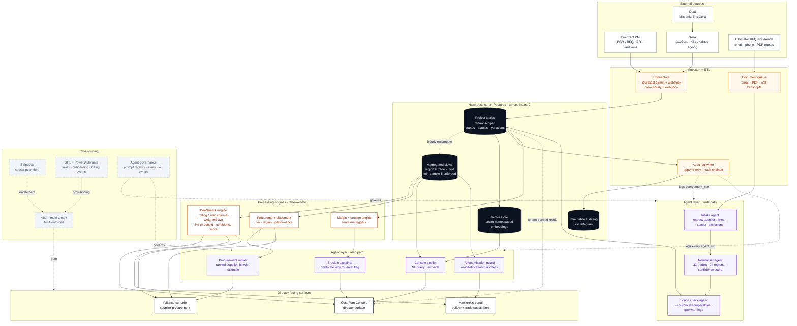
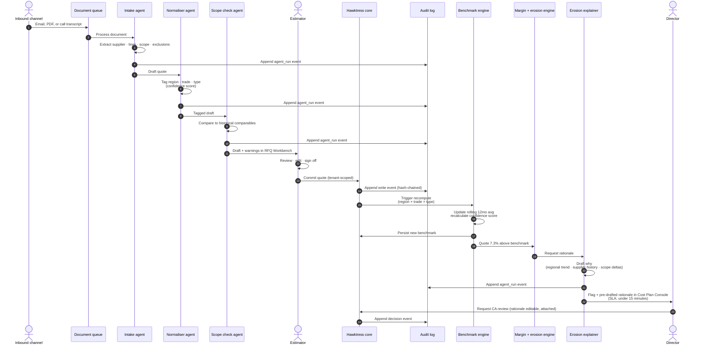
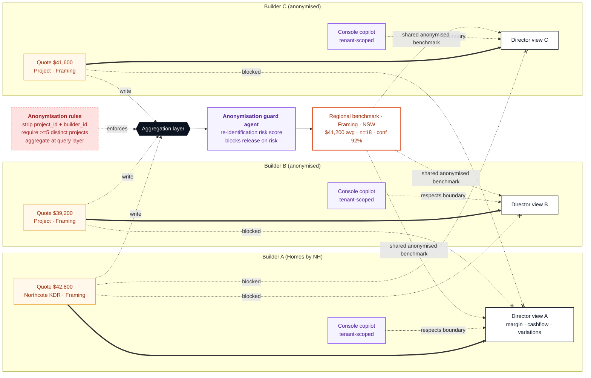

# BuildHawk · Technical workflow map

Source for every diagram on the `/command-centre/architecture` page. Paste any block into Mermaid Live, GitHub markdown, Notion, or the Figma Mermaid plugin to reproduce or fork.

PRD reference: BuildHawk Technical PRD v1.0 §6 (system architecture), §7.1–7.7 (modules), §8 (data model), §9 (integrations).

The `agent` class (violet) marks non-deterministic LLM-backed components. Every agent call is governed by the Agent governance service and writes a hash-chained `agent_run` event to the immutable audit log alongside its structured output.

---

## 1. System architecture

End-to-end view: external sources, ingestion + ETL, write-path agent layer, Hawktress core, deterministic processing engines, read-path agent layer, director-facing surfaces. Cross-cutting concerns rendered alongside.

---

## 2. Data lifecycle: from quote to flagged tile

A trade quote enters the workbench (after extraction and classification by the Intake and Normaliser agents) and ends up as a margin erosion flag with a pre-drafted rationale in the director's view, in under 15 minutes. Every step, including every agent run, writes a hash-chained entry to the immutable audit log.

---

## 3. Tenant isolation + anonymisation boundary

The commercial moat. Each builder owns their raw project data. Aggregated benchmarks are stripped of identifiers and only released when sample size meets the threshold. The Anonymisation guard agent runs as a final check on every aggregated payload, blocking release when the re-identification risk score exceeds policy. Per-tenant Console copilots respect the same boundary at the agent layer.

