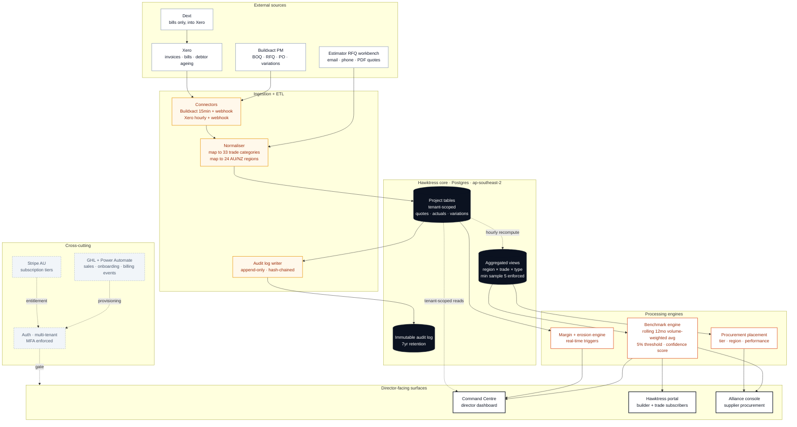
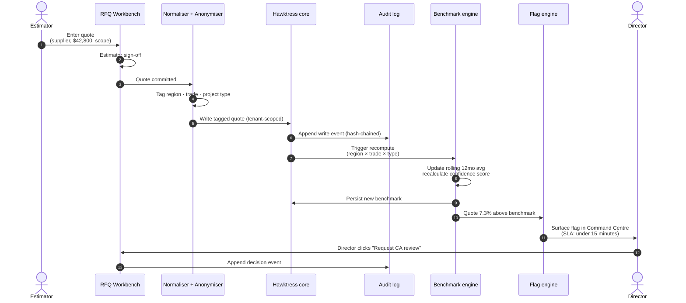
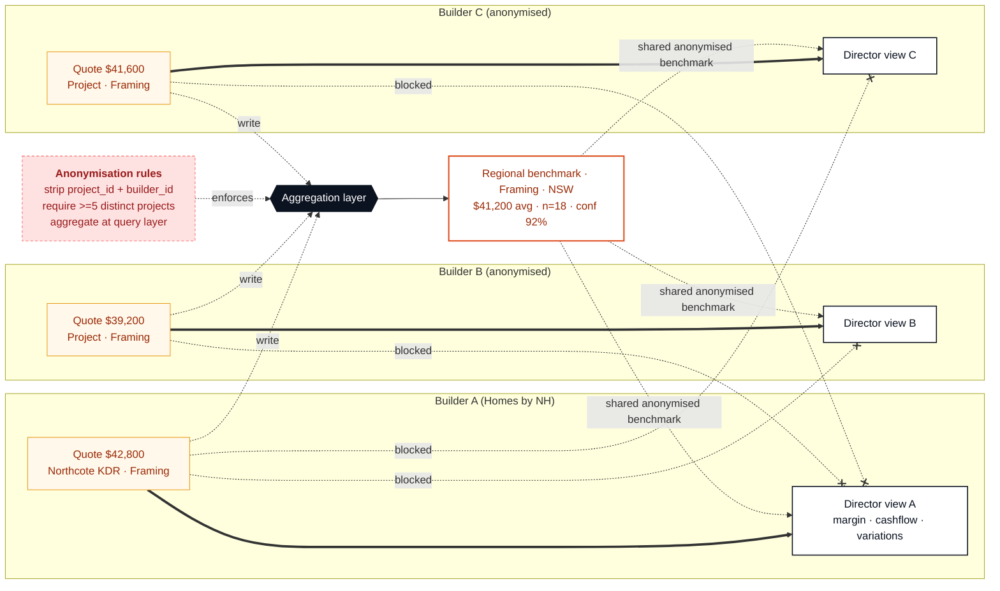

# BuildHawk · Technical workflow map

Source for every diagram on the `/command-centre/architecture` page. Paste any block into Mermaid Live, GitHub markdown, Notion, or the Figma Mermaid plugin to reproduce or fork.

PRD reference: BuildHawk Technical PRD v1.0 §6 (system architecture), §7.1–7.7 (modules), §8 (data model), §9 (integrations).

---

## 1. System architecture

End-to-end view: external sources, ingestion + ETL, Hawktress core, processing engines, director-facing surfaces. Cross-cutting concerns rendered alongside.

---

## 2. Data lifecycle: from quote to flagged tile

A trade quote enters the workbench and ends up as a margin erosion flag in the director's view, in under 15 minutes. Every step has an audit log entry.

---

## 3. Tenant isolation + anonymisation boundary

The commercial moat. Each builder owns their raw project data. Aggregated benchmarks are stripped of identifiers and only released when sample size meets the threshold. This is what stops Hawktress from being a generic data product anyone can audit.

